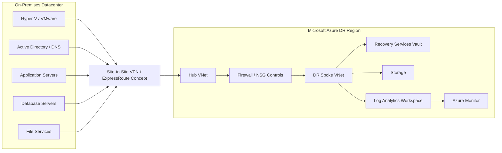

# Project 01 — Enterprise Hybrid Azure DR & Automation

## Executive Summary

This project models how a senior infrastructure engineer would assess, design, automate, test, and document a hybrid disaster recovery solution for an enterprise moving recovery capabilities into Microsoft Azure.

The fictional organization operates VMware and Hyper-V workloads on-premises and requires an Azure-based DR target that improves resiliency while preserving operational control, security, and recoverability.

## Business Scenario

Contoso Manufacturing operates business-critical Windows workloads in an on-premises datacenter. Existing recovery procedures rely on local backup infrastructure and manual recovery processes. Leadership requires a modern DR design in Azure with documented recovery objectives, repeatable deployment, operational monitoring, and a tested failover/failback process.

### Primary Objectives

- Establish a secure Azure DR landing zone.
- Classify workloads by business criticality.
- Define and validate RPO/RTO targets.
- Identify application, DNS, identity, storage, and network dependencies.
- Deploy core Azure DR infrastructure with Terraform.
- Assess workload readiness with PowerShell.
- Document migration risk, rollback, failover, failback, and DR testing.
- Validate code through GitHub Actions.

## Architecture Principles

1. **Recoverability before migration speed** — a migration is not successful unless recovery is understood and tested.
2. **Infrastructure as Code** — repeatable deployment reduces configuration drift and manual error.
3. **Least privilege** — RBAC and network controls are defined intentionally.
4. **Observability by design** — monitoring and logging are part of the platform, not an afterthought.
5. **Dependency-aware recovery** — applications are restored in an order that respects identity, DNS, database, storage, and application dependencies.
6. **Documented rollback** — every migration/cutover decision must include a reversible path where feasible.

## Target Architecture



## Recovery Tier Model

| Tier | Example Workload | Target RPO | Target RTO | Recovery Priority |
|---|---|---:|---:|---|
| Tier 0 | AD / DNS / Identity | 15 min | 1 hr | First |
| Tier 1 | Database / Revenue-Critical Apps | 30 min | 2 hr | Second |
| Tier 2 | Departmental Applications | 4 hr | 8 hr | Third |
| Tier 3 | File / Low-Criticality Services | 24 hr | 24 hr | Fourth |

## Planned Deliverables

### Terraform
- Resource groups
- Hub/spoke virtual networks
- Subnets and NSGs
- Route tables
- Storage account
- Recovery Services Vault
- Log Analytics workspace
- Monitoring resources

### PowerShell
- `Get-WorkloadInventory.ps1`
- `Test-HybridDRReadiness.ps1`
- `New-DRReadinessReport.ps1`

### Operations Documentation
- Architecture overview
- Design decisions
- Assumptions and constraints
- Migration plan
- Risk register
- DR test plan
- Failover runbook
- Failback runbook
- Rollback plan
- Lessons learned

### CI/CD
GitHub Actions will validate:
- Terraform formatting
- Terraform initialization and validation
- Terraform linting
- PowerShell static analysis

## Repository Structure

```text
01-Hybrid-Azure-DR-Automation/
├── README.md
├── docs/
├── terraform/
│   ├── modules/
│   └── environments/lab/
├── powershell/
├── samples/
├── screenshots/
└── .github/workflows/
```

## Portfolio Positioning

This project is intentionally structured as an engineering case study rather than a basic cloud lab. It is designed to demonstrate architecture depth, migration planning, operational stability, automation, disaster recovery, and production-style documentation.

> All company names, workloads, IP addresses, recovery objectives, and scenarios are fictionalized for portfolio and training purposes.